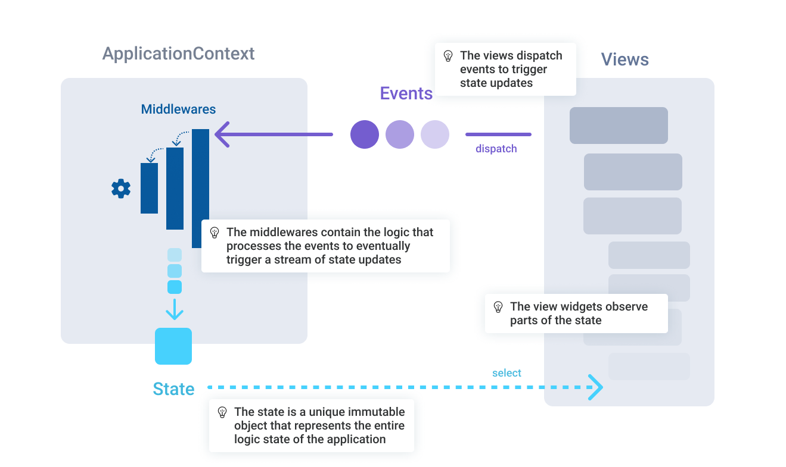

The modular state management solution for flutter.

* *Easy debugging* : each event is predictable and goes into a single pipeline
* *Centralized state* : solid state validation
* *Power of async generators* : writing asynchronous code is easy thanks to Dart generators

## Quickstart

The global logical state of our application :

```dart
class CounterState {
  factory CounterState.initial() => const CounterState(0, 10);
  const CounterState(this.count, this.max);
  final int count;
  final int max;
  bool get isMax => count >= max;
}
```

The available actions that alterate the logical state of the application :

```dart
class AddAction extends ApplicationAction<CounterState> {
  const AddAction(this.value);
  final int value;
  @override
  Stream<ApplicationStateUpdater<CounterState>> call(
    ApplicationContext<CounterState> context,
  ) async* {
    yield (state) => CounterState(min(state.count + value, state.max), state.max);
  }
}

class ResetAction extends ApplicationAction<CounterState> {
  @override
  Stream<ApplicationStateUpdater<CounterState>> call(
    ApplicationContext<CounterState> context,
  ) async* {
    yield (state) => CounterState(0, state.max);
  }
}

class SaveAction extends ApplicationAction<CounterState> {
  @override
  Stream<ApplicationStateUpdater<CounterState>> call(
    ApplicationContext<CounterState> context,
  ) async* {
    await File(_cachePath).writeAsString(context.state.count.toString());
  }
}

class LoadAction extends ApplicationAction<CounterState> {
  @override
  Stream<ApplicationStateUpdater<CounterState>> call(
    ApplicationContext<CounterState> context,
  ) async* {
    final content = await File(_cachePath).readAsString();
    final count = int.parse(content);
    yield (state) => CounterState(min(count, state.max), state.max);
  }
}
```

The view that subscribes to the state changes and dispatches actions :

```dart
class MyHomePage extends StatelessWidget {
  MyHomePage({Key? key}) : super(key: key);

  @override
  Widget build(BuildContext context) {
    return Scaffold(
      appBar: AppBar(
        title: Text('Flutter Demo Home Page'),
      ),
      body: Center(
        child: Column(
          mainAxisAlignment: MainAxisAlignment.center,
          children: <Widget>[
            Text(
              'You have pushed the button this many times:',
            ),
            Builder(
              builder: (context) {
                /// This widget will be rebuilt each time the `count` value changes
                final count =
                    context.select((CounterState state) => state.count);
                return Text(
                  '$count',
                  style: Theme.of(context).textTheme.headline4,
                );
              },
            ),
          ],
        ),
      ),
      floatingActionButton: Builder(
        builder: (context) {
          /// This widget will be rebuilt each time the `isMax` value changes
          final isMax = context.select((CounterState state) => state.isMax);
          if (isMax) {
            return FloatingActionButton(
              /// The action is executed in the [ApplicationContext].
              onPressed: () => context.dispatch<CounterState>(ResetAction()),
              tooltip: 'Reset',
              child: Icon(Icons.delete),
            );
          }

          return FloatingActionButton(
            /// The action is executed in the [ApplicationContext].
            onPressed: () => context.dispatch<CounterState>(AddAction(1)),
            tooltip: 'Increment',
            child: Icon(Icons.add),
          );
        },
      ),
    );
  }
}
```

The state initialization :

```dart
class MyApp extends StatelessWidget {
  @override
  Widget build(BuildContext context) {
    return ApplicationProvider(
      initialState: (context) => CounterState.initial(),
      child: MaterialApp(
        title: 'Flutter Demo',
        theme: ThemeData(
          primarySwatch: Colors.blue,
        ),
        home: MyHomePage(),
      ),
    );
  }
}
```

## Core concepts



### ApplicationContext<State>

The application context maintains a unique global logical immutable state for the application.

The context also contains all the middlewares that will process the dispatched event.

The application context is provided to the widget tree from an `ApplicationProvider` so that any descendent widget can observe a property of the state with the `select` extension method. It can also dispatch events into the middlewares with the `dispatch` extension methods.

### ApplicationMiddleware

The application middleware process the dispatched `ApplicationEvent`s and can produce state updates.

They are composable by nature which means that each middleware can wrap another middleware.

### ApplicationEvent

The events are inputs for middlewares. They can describe a user action, or a system event for exemple. They are processed by the middlewares which can produce new application states.

## Included middlewares

### Actions

By default, the framework includes a `ApplicationActionExecutor` middleware that allows to define `ApplicationActions` which are then invokes directly to produce new states.

### Logger

The framework also includes an `ApplicationLogger` middleware that logs all actions and state updates.

##  About

### Wait ... yet another state management solution for Flutter ?

Fountain is not so new to me, I've used this approach for a longtime now. Centralizing it as an opensource library makes a lot of sense to create a standard for a all of my personal and professional projects.

### Inspired by

This project stands on the shoulders of giants, with the intention of reducing boilerplate, being minimalist and simple at its core.

* [Redux](https://pub.dev/packages/redux) for the functional update cycle and general principles with the purpose of having less boilerplate by being more opiniated.
* [Express](https://expressjs.com/) | [Koa](https://koajs.com/) for their composability and modularity thanks to middlewares.
* [Bloc](https://pub.dev/packages/bloc) for its use of Streams.
* [Provider](https://pub.dev/documentation/provider/latest/provider/SelectContext.html) for its `select` method.

### How is it different from other popular solutions ?

* [Provider](https://pub.dev/packages/provider) : Fountain is a lot more opiniated than Provider, and thus Provider is a more general purpose tool. It is often used in combination with a `ChangeNotifier` to create a simple solution.
* [Redux](https://pub.dev/packages/flutter_redux) : Fountain has the same overall philosophy than Redux with `Thunks` but brings less boilerplate when dealing with asynchronous with `ApplicationAction`s logic by using `Stream`s. Fountain also brings the middleware concept.
* [Bloc](https://pub.dev/packages/flutter_bloc) : Fountain use a global state instead of various `Blocs`. We believe it is important since there's a lot of areas which need to be aware of another part of your app logic. With a global state, each state update can be verified so that it does not break another part of the application.